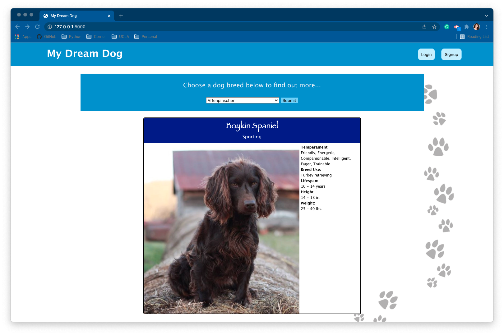
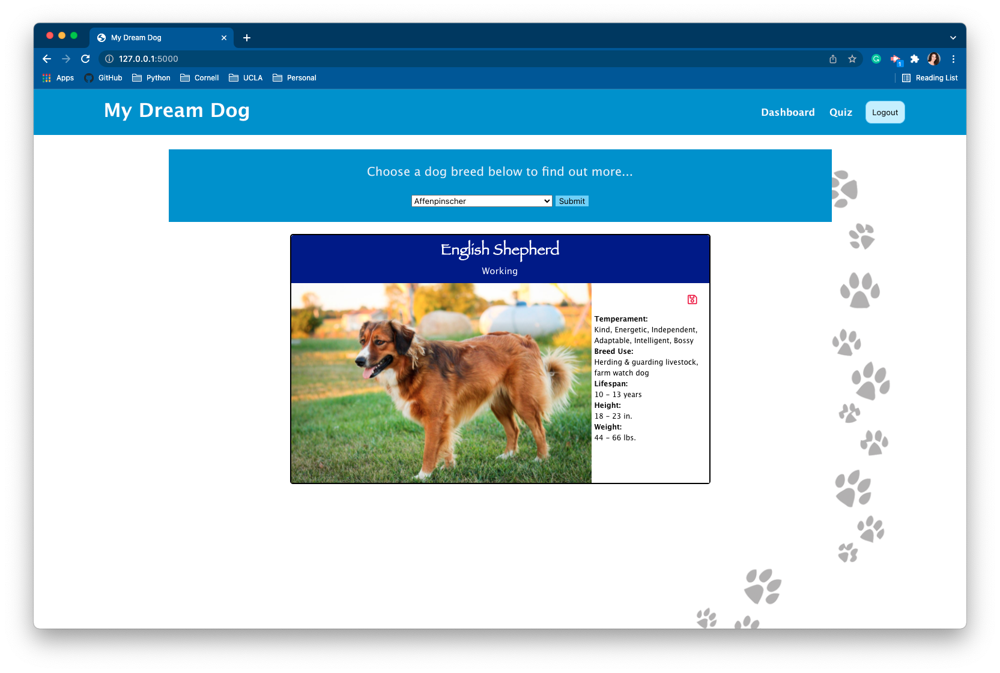
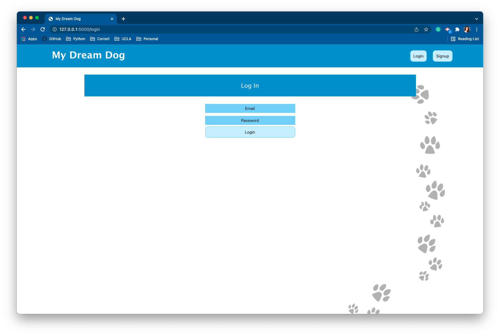
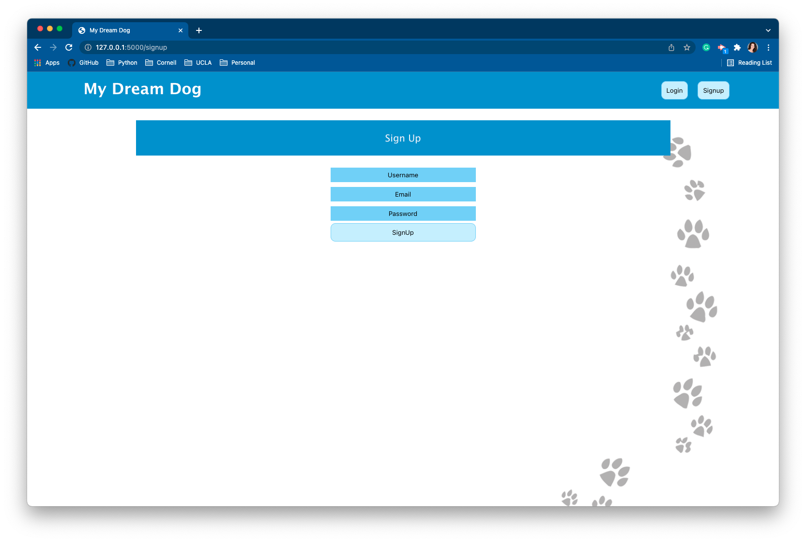
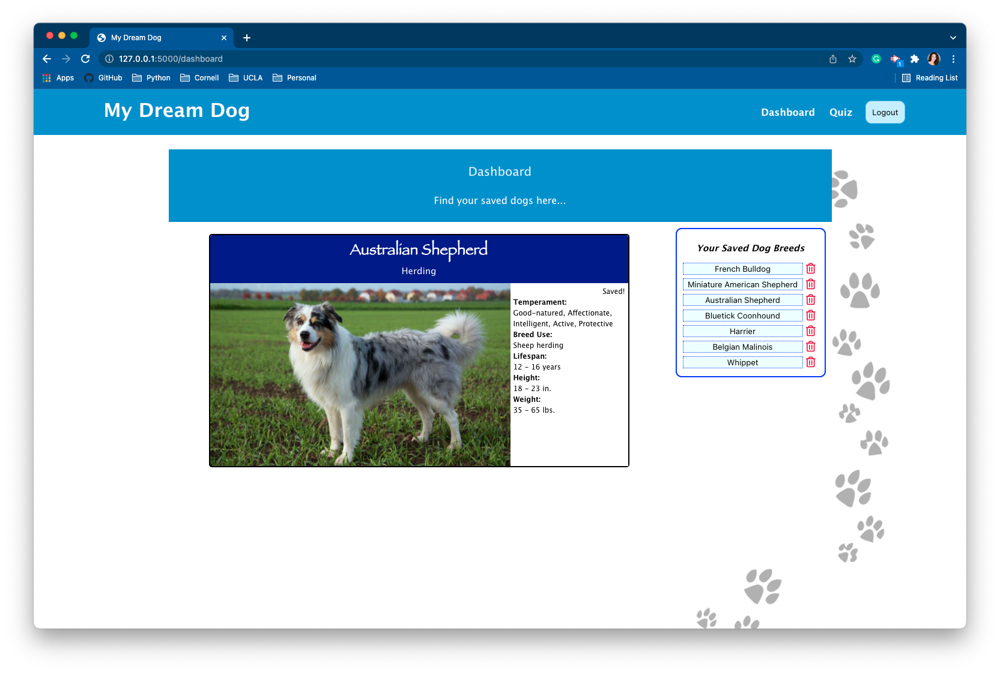
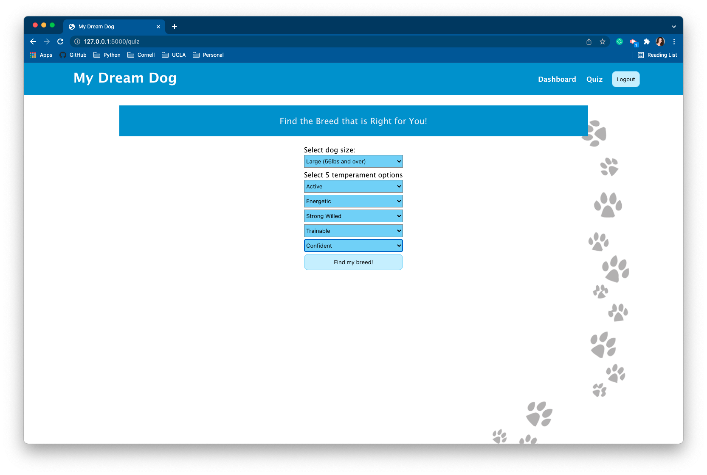
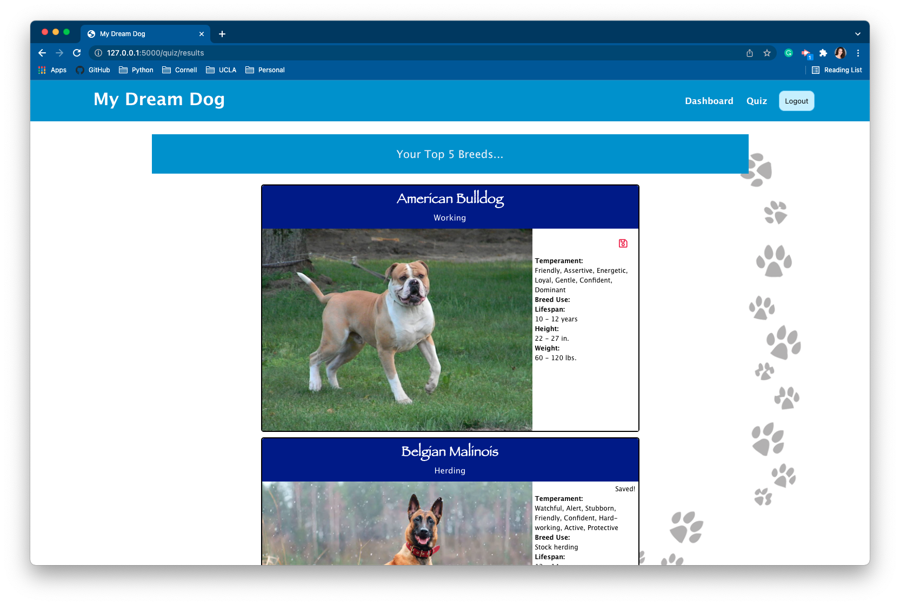

# My Dream Dog 

Where the user will find the perfect dog breed for them.

## Description

My Dream Dog is a Python project that allowes a user to create an account then access and save specific data from an online api.

My Dream Dog allows the user to discover the perfect dog breeds for them. Search through a list of over 250 breeds or take the quiz to see what breeds meet the user's size and temperament requirements. The user can save and delete their favorite breeds to their own personal account dashboard.

## Table of Contents
  
* [Description](#description)
* [Features](#features)
* [Languages](#languages)
* [Links](#links)
* [Roadmap](#roadmap)
* [Usage](#usage)
* [Screenshots](#screenshots)

## Features
    
- User Interface
- Full list of all dog breeds from TheDogAPI
- Breeds can be saved or deleted from user's dashboard
- Find 5 dog breeds that meet your size and temperament requirements using the Quiz
- Search through over 250 dog breeds
- Basic breed information displayed when selected

## Languages

Python, Jinja2, Django, MySQL, JavaScript, HTML, CSS

## Links 

[My Dream Dog Deployed Page](https://my-dream-dog.herokuapp.com/)

[My Dream Dog GitHub](https://github.com/ericasiegel/my-dream-dog.git)

## Roadmap

- Develop the quiz to include more personal questions
- Add links for user to find adoptable dogs, based off of saved breeds, in their area

## Usage

The user will be able to create an account where they will be able to see their favorite dog breeds saved on their dashboard page. They can either search through the breed list on the main page, or they can take the quiz to get the top 5 breeds that meet their size and temperment requirements. They are able to get basic information about each breed, save it, and delete it from their dashboard.

## Screenshots
    
### Main Page / Not Logged In

### Main Page / Logged In

### Login

### Signup

### User Dashboard

### Quiz

### Quiz Results - Top 5 Breeds

## Credits

- [Python](https://docs.python.org/3/)
- [Django](https://docs.djangoproject.com/en/4.0/)
- [Jinja](https://jinja.palletsprojects.com/en/3.0.x/)
- [MySQL](https://dev.mysql.com/doc/)
- [Bulma](https://bulma.io/documentation/)

    